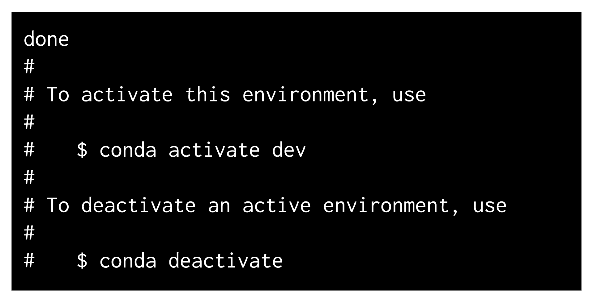
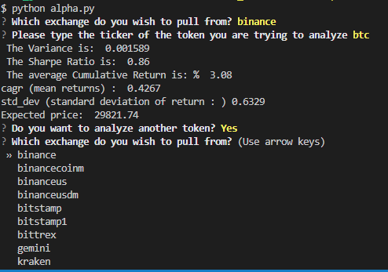
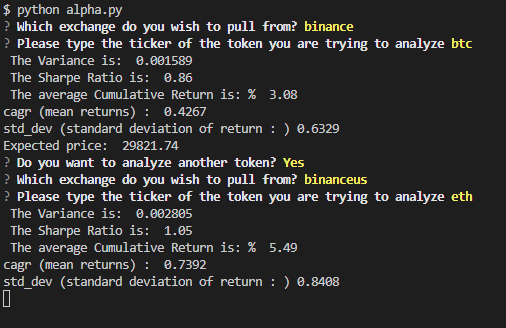

# Crypto Dashboard and Price Predictor
**Project 1 for Fintech bootcamp through UC Berkeley.**

# Project Description
We created an asset price predictor using monte carlo simulations. The code will pull in data from an API and grab the most recent data for the token of your choice in the form of daily candles. It will then run analysis on that token plotting the data pulled in. Shortly after you see the values for Variance, Sharpe ratio, Mean Annual percentage return, and standard deviation. After it will show a chart with the moving averages for the 50 and 200 day. Next the program will run a series of monte carlo simulations and show you possible projections of where price could go in the next year utilizing the results provided above. Finally you will see a normal distribution chart showing the results of the simulations and an expected 'average' price the asset will be around a year later. 

Currently we have two live and running prototypes. The first is our alpha test file `alpha.py` that runs using the questionary package and utilizing the ccxt package to get data. This file is stable and runs in VS code or a similar IDE. More details below on how to get started on your local machine.
The second prototype we currently have running is a website [deployed](https://jedandroby-crypto-stock-dashboard-test-gilg5r.streamlit.app/) via streamlit utilizing this very GitHub repo! The file containing the code for that dashboard is located in the `dashboard.py` file. 

---
## Package Requirements and versions
First before installing any packages and getting setup make sure you are in a `dev` environment or an environment you are comfortable downloading packages into. If you don't know what a `dev` environment is follow along below. 
To get your `dev` environment setup do the following in your command line:

- Creating a dev environment for python 3.7 called 'dev' - if you do not already have an environment setup 
    - Get setup in your preferred CLI (Gitbash, terminal, etc)
    - `conda create -n dev python=3.7 anaconda`
    - Once you have created the environment, type the following to activate and deactivate.

Packages needed will depend on what you are trying to do. Since the dashboard is [deployed](https://jedandroby-crypto-stock-dashboard-test-gilg5r.streamlit.app/) already these steps will be if you decide to clone the repo and run the `alpha.py` file locally

Once you have cloned the repo and have a `dev` or similar env with python 3.7 or higher the next step is to make sure you have the packages installed locally. Navigate to the newly cloned repo and make sure you are in the `alpha` directory. 
Then type `pip install requirements.txt`, this will install any necessary packages to your env. 

---
## File Navigation
- `alpha` -- Contains `alpha.py` and `requirements.txt` needed for running alpha product, analysis using VS code
- `Dashboard testing` -- Contains files needed for testing of panels dashboard
- `docs` -- Contains `functions.py` and `kaio.ipynb` which both include helper functions and workspace code for finding solutions and building app
- `Images` -- Contains .png files used for `readme.md`
- `Workflow updates` -- Contains .txt files for contributors used for updating work they did and what they were looking into.
- `test.py` -- file used for deploying streamlit dashboard.

---
## Usage 

Now that you have the env setup and the requirements installed, open your VS code or similar IDE, make sure you are in the alpha directory and type `python alpha.py`. 
You should see something similar to this  

This image above shows a full run through of the app and starts over. Simply navigate through and pick your exchanges/tokens, and the code will find a USD pair to run the analysis on.
 

when you get to this point you will get four pop-up images that show the results of the monte carlo simulations, simply close each one and the program will continue and ask if you want to go again!

---

## Contributors

[Robin Thorsen](https://www.linkedin.com/in/robin-thorsen-079819120/), Alex Valenzuela, [Kaio Farkouh](https://www.linkedin.com/in/kaio-farkouh/), Zach Eras are the developers/analysts who worked on this project. 

---

## License

Apache 2.0 public License applied, feel free to clone and fork and use and reach out if you have questions. 

