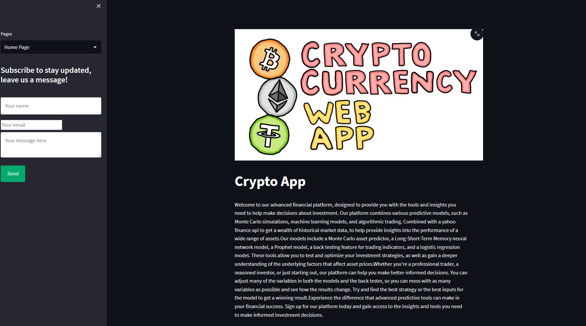

# Crypto Dashboard and Price Predictor
**Project 2 for Fintech bootcamp through UC Berkeley.**

# Project Description
We created a website that can be used to analyze various cryptocurrencies based on a USD pair. There are multiple pages on this website ranging from simple montecarlo simulations to predict price, to complex recurring neural networks, and a algorithmic trading back tester based on trading strategies.
The website pulls in data from a yahoo API and grabs the most recent data for the token of your choice in the form of daily candles. There are multiple pages when you first go to the site. The 'Home Page', 'Monte Carlo Simulator', 'Long Short-Term Memory model’, ‘Prophet', 'Trading Back tester', 'Linear Regression Model'. Each page uses the same data and offers its own unique way to analyze market data and help make informed decisions. Feel free to reach out to the developers on the Home Page and give us your feedback for things to make better in the future!

This app is currently deployed using streamlit and is live running right [here!](https://jedandroby-crypto-stock-dashboard-main-wj0sx8.streamlit.app/) Feel free to click the link and enjoy our website! For some reason on the trading backtester the code seems to have an issue running with BTC data. Every other token works though, we are working on fixing this. Follow along below if you want to learn how to run it locally where it can pull in BTC data no problem, to make any changes to edits to fit your preference.  

---
## Package Requirements and versions
First before installing any packages and getting setup make sure you are in a `dev` environment or an environment you are comfortable downloading packages into. If you don't know what a `dev` environment is follow along below. 
To get your `dev` environment setup do the following in your command line:

- Creating a dev environment for python 3.7 called 'dev' - if you do not already have an environment setup 
    - Get setup in your preferred CLI (Gitbash, terminal, etc)
    - `conda create -n dev python=3.7 anaconda`
    - Once you have created the environment, type the following to activate and deactivate.

Once you have cloned the repo and have a `dev` or similar env with python 3.7 or higher the next step is to make sure you have the packages installed locally. Navigate to the newly cloned repo and make sure you are in the right directory. 
Then type `pip install requirements.txt`, this will install any necessary packages to your env. 

*NOTE if you get errors installing requirements with ta-lib, use conda install -c conda-forge ta-lib"*

---
## File Navigation
- `Main.py` -- File used for deploying code to streamlit website
- `docs` -- Contains `functions.py` and which includes all functions
- `Images` -- Contains .png files used for `readme.md`
- `Workflow updates` -- Contains .txt files for contributors used for updating work they did and what they were looking into. (was not updated at all for project 2) 

---
## Usage -Streamlit Dashboard
To get streamlit running locally and to start browsing the site, start by making sure your `dev` env is running and has the `requirements.txt` installed. Finally, inside your preferred CLI make sure you in the right directory with the `Main.py` file, and type the following command - ` streamlit run Main.py` -. You should see the terminal run some code and a website with a local host IP address will pop up that should look similar to this -

Once you're in feel free to change the tickers and explore the dashboard and see the results! None of this is financial advice, purely just for curiosity to see what the various models think price will be at a future date and how well different strategies would do based on when you buy and sell.
To explore the different models and pages just click the drop down in the top left like the following image shows. 

This will allow you to select any of the pages and make any adjustments you wish! 

---

## Contributors

[Robin Thorsen](https://www.linkedin.com/in/robin-thorsen-079819120/), [Kaio Farkouh](https://www.linkedin.com/in/kaio-farkouh/), [Zach Eras](https://www.linkedin.com/in/zachary-eras-24b5a8149/) are the developers/analysts who worked on this project. 

---

## License

Apache 2.0 public License applied, feel free to clone and fork and use and reach out if you have questions. 

